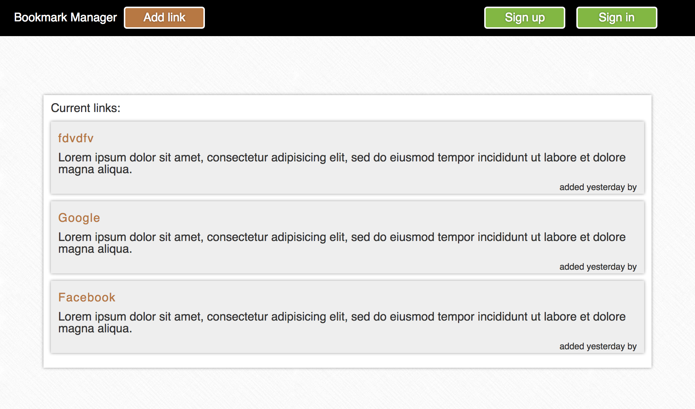

Bookmark_manager
================

We are going to build a bookmark manager, similar to pineapple.io or delicious.com in spirit. This is where we explored relational databases and using the Mailgun API.



A bookmark manager is a website to maintain a collection of links, organised by tags. You can use it to save a webpage you found useful. You can add tags to the webpages you saved to find them later. You can also browse links other users have added.

The website will has the following functionality:

- Sign up and Log in
- Encrypted password storage (Bcrypt)
- "Forgot password" with a new one being sent by email (Mailgun)
- Show a list of links from the database
- Add new links
- Add tags to the links
- Filter the links by a tag

###Take a look at the code
```sh
git clone git@github.com:jamieallen59/Bookmark_manager.git
cd Bookmark_manager
```

open the file with your text editor e.g. "subl ." (for Sublime Text)

###Run the tests
```sh
cd Bookmark_manager
rspec
```